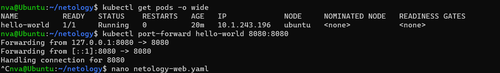
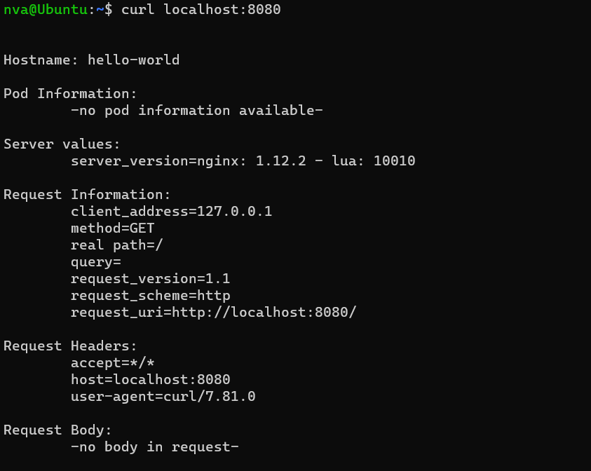
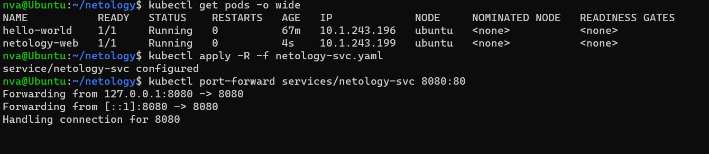
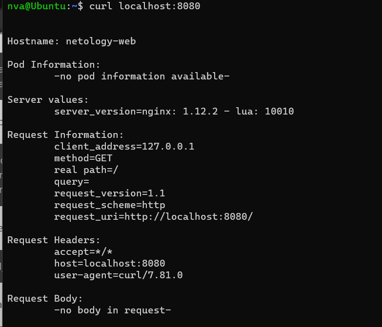

# Домашнее задание к занятию «Базовые объекты K8S» - Нечаев Владимир

Цель задания, чеклист готовности к домашнему заданию, инструменты и дополнения

В тестовой среде для работы с Kubernetes, установленной в предыдущем ДЗ, необходимо развернуть Pod с приложением и подключиться к нему со своего локального компьютера. 

------

### Чеклист готовности к домашнему заданию

1. Установленное k8s-решение (например, MicroK8S).
2. Установленный локальный kubectl.
3. Редактор YAML-файлов с подключенным Git-репозиторием.

------

### Инструменты и дополнительные материалы, которые пригодятся для выполнения задания

1. Описание [Pod](https://kubernetes.io/docs/concepts/workloads/pods/) и примеры манифестов.
2. Описание [Service](https://kubernetes.io/docs/concepts/services-networking/service/).

Задание 1. Создать Pod с именем hello-world

1. Создать манифест (yaml-конфигурацию) Pod.
2. Использовать image - gcr.io/kubernetes-e2e-test-images/echoserver:2.2.
3. Подключиться локально к Pod с помощью `kubectl port-forward` и вывести значение (curl или в браузере).

Задание 2. Создать Service и подключить его к Pod

1. Создать Pod с именем netology-web.
2. Использовать image — gcr.io/kubernetes-e2e-test-images/echoserver:2.2.
3. Создать Service с именем netology-svc и подключить к netology-web.
4. Подключиться локально к Service с помощью `kubectl port-forward` и вывести значение (curl или в браузере).

### Ответ:
Задание 1. Открываем порты:

Задание 1. Вывод curl:

Задание 2. Открываем порты:

Задание 2. Вывод curl:

### [Ссылка на манифесты!](https://github.com/vanechaev/study/tree/1ebd8bef787a60c902327f4db28758dda8381eac/Kuber/files/1.2)
