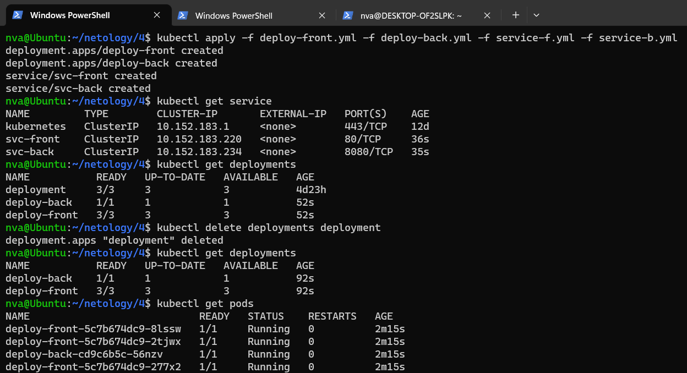
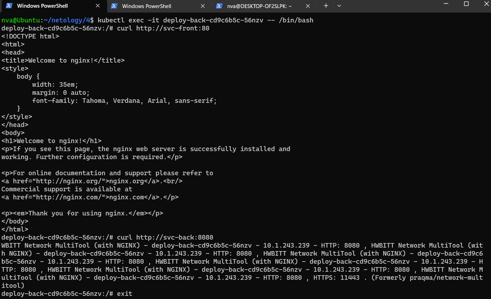
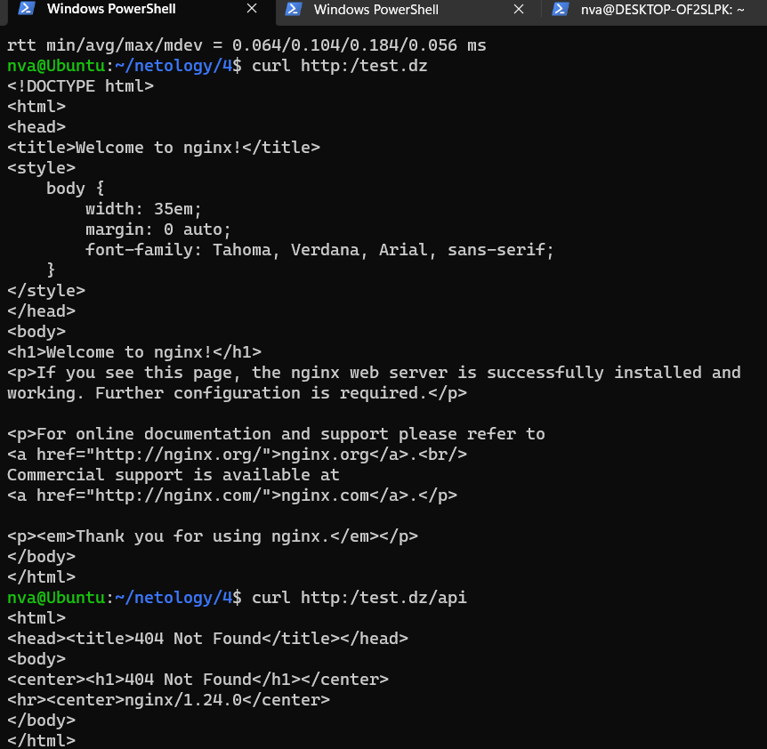

# Домашнее задание к занятию «Сетевое взаимодействие в K8S. Часть 2» - Нечаев Владимир

Цель задания, чеклист готовности к домашнему заданию, инструменты и дополнения

В тестовой среде Kubernetes необходимо обеспечить доступ к двум приложениям снаружи кластера по разным путям.

------

### Чеклист готовности к домашнему заданию

1. Установленное k8s-решение (например, MicroK8S).
2. Установленный локальный kubectl.
3. Редактор YAML-файлов с подключённым Git-репозиторием.

------

### Инструменты и дополнительные материалы, которые пригодятся для выполнения задания

1. [Инструкция](https://microk8s.io/docs/getting-started) по установке MicroK8S.
2. [Описание](https://kubernetes.io/docs/concepts/services-networking/service/) Service.
3. [Описание](https://kubernetes.io/docs/concepts/services-networking/ingress/) Ingress.
4. [Описание](https://github.com/wbitt/Network-MultiTool) Multitool.

Задание 1. Создать Deployment приложений backend и frontend

1. Создать Deployment приложения _frontend_ из образа nginx с количеством реплик 3 шт.
2. Создать Deployment приложения _backend_ из образа multitool. 
3. Добавить Service, которые обеспечат доступ к обоим приложениям внутри кластера. 
4. Продемонстрировать, что приложения видят друг друга с помощью Service.
5. Предоставить манифесты Deployment и Service в решении, а также скриншоты или вывод команды п.4.

Задание 2. Создать Ingress и обеспечить доступ к приложениям снаружи кластера

1. Включить Ingress-controller в MicroK8S.
2. Создать Ingress, обеспечивающий доступ снаружи по IP-адресу кластера MicroK8S так, чтобы при запросе только по адресу открывался _frontend_ а при добавлении /api - _backend_.
3. Продемонстрировать доступ с помощью браузера или `curl` с локального компьютера.
4. Предоставить манифесты и скриншоты или вывод команды п.2.

### Ответ: 

Задание 1:

Создал и запустил деплоймент и сервисы ([deploy-front.yml](files/1.5/deploy-front.yml), [deploy-back.yml](files/1.5/deploy-back.yml), [service-f.yml](files/1.5/service-f.yml), [service-b.yml](files/1.5/service-b.yml) )

Демонстрация, что приложения видят друг друга

Задание 2:

Включил Ingress-controller в MicroK8S. `microk8s enable ingress`

Cоздал [ingress.yml](files/1.5/ingress.yml)

Демонстрация доступа с помощью `curl`

