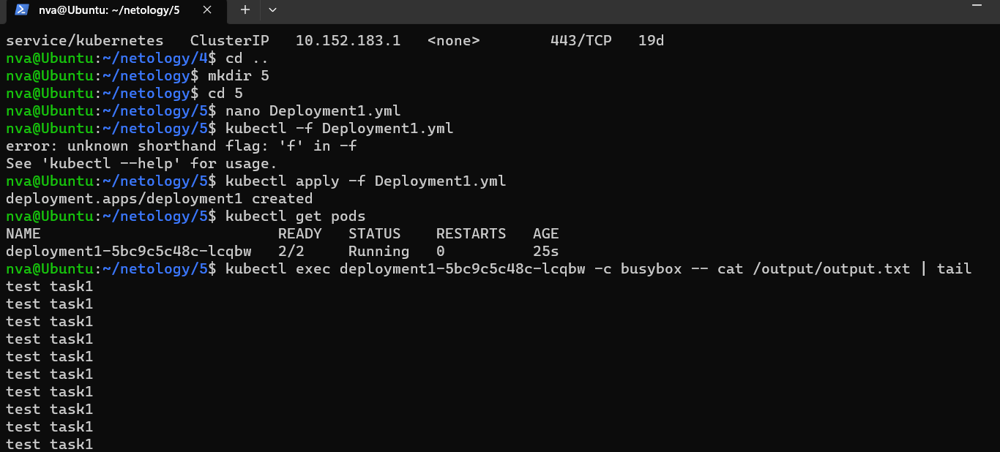
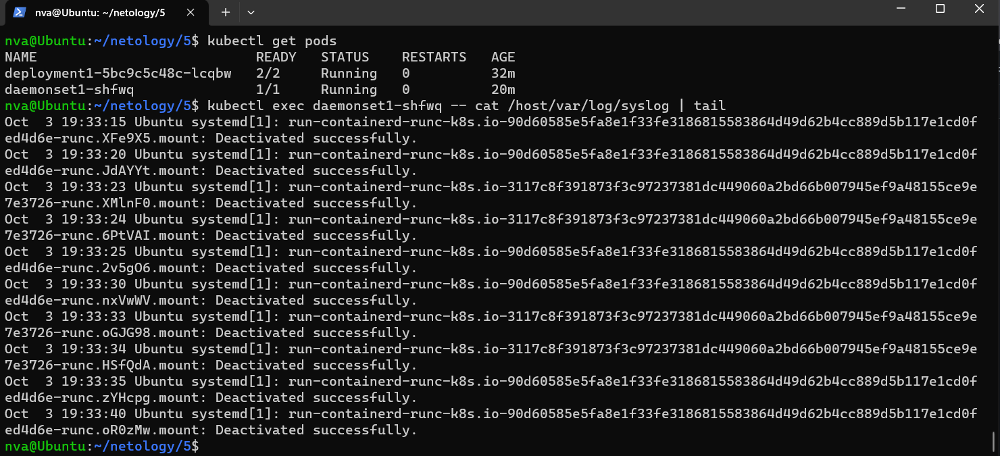

# Домашнее задание к занятию «Хранение в K8s. Часть 1» - Нечаев Владимир

<details>
<summary>Цель задания, чеклист готовности к домашнему заданию,дополнительные материалы</summary>

В тестовой среде Kubernetes нужно обеспечить обмен файлами между контейнерам пода и доступ к логам ноды.

------

### Чеклист готовности к домашнему заданию

1. Установленное K8s-решение (например, MicroK8S).
2. Установленный локальный kubectl.
3. Редактор YAML-файлов с подключенным GitHub-репозиторием.

------

### Дополнительные материалы для выполнения задания

1. [Инструкция по установке MicroK8S](https://microk8s.io/docs/getting-started).
2. [Описание Volumes](https://kubernetes.io/docs/concepts/storage/volumes/).
3. [Описание Multitool](https://github.com/wbitt/Network-MultiTool).

</details>

<details>
<summary>Задание 1</summary>

**Что нужно сделать**

Создать Deployment приложения, состоящего из двух контейнеров и обменивающихся данными.

1. Создать Deployment приложения, состоящего из контейнеров busybox и multitool.
2. Сделать так, чтобы busybox писал каждые пять секунд в некий файл в общей директории.
3. Обеспечить возможность чтения файла контейнером multitool.
4. Продемонстрировать, что multitool может читать файл, который периодоически обновляется.
5. Предоставить манифесты Deployment в решении, а также скриншоты или вывод команды из п. 4.

</details>

<details>
<summary>Задание 2</summary>

**Что нужно сделать**

Создать DaemonSet приложения, которое может прочитать логи ноды.

1. Создать DaemonSet приложения, состоящего из multitool.
2. Обеспечить возможность чтения файла `/var/log/syslog` кластера MicroK8S.
3. Продемонстрировать возможность чтения файла изнутри пода.
4. Предоставить манифесты Deployment, а также скриншоты или вывод команды из п. 2.

</details>

### Решение:

Задание 1:

Манифест Deployment:
```yaml
---
apiVersion: apps/v1
kind: Deployment
metadata:
  name: deployment1
  labels:
    app: deployment1
spec:
  replicas: 1
  selector:
    matchLabels:
      app: deployment1
  template:
    metadata:
      labels:
        app: deployment1
    spec:
      containers:
        - name: busybox
          image: busybox
          command: ['sh', '-c', 'while true; do echo test task1 >> /output/output.txt; sleep 5; done']
          volumeMounts:
            - name: volume1
              mountPath: /output
        - name: multitool
          image: wbitt/network-multitool
          volumeMounts:
            - name: volume1
              mountPath: /input
      volumes:
        - name: volume1
          emptyDir: {}
```

Скриншот выполнения:



 Задание 2:

Манифест DaemonSet:
```yaml
---
apiVersion: apps/v1
kind: DaemonSet
metadata:
  name: daemonset1
  labels:
    app: daemonset1
spec:
  selector:
    matchLabels:
      app: daemonset1
  template:
    metadata:
      labels:
        app: daemonset1
    spec:
      containers:
        - name: multitool
          image: wbitt/network-multitool
          volumeMounts:
            - name: volume2
              mountPath: /host/var/log
      volumes:
        - name: volume2
          hostPath:
            path: /var/log
```

Скриншот выполнения:


