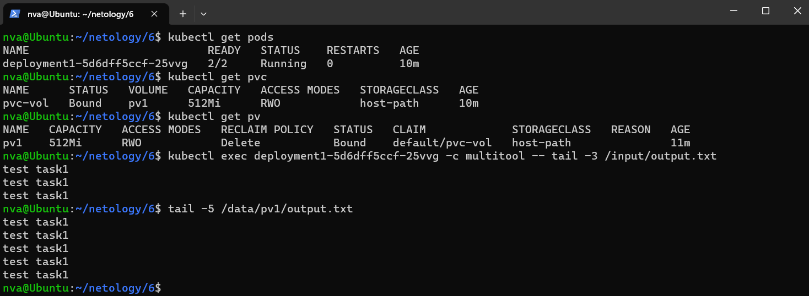
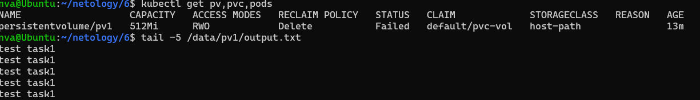
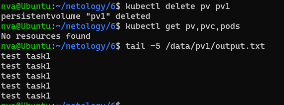
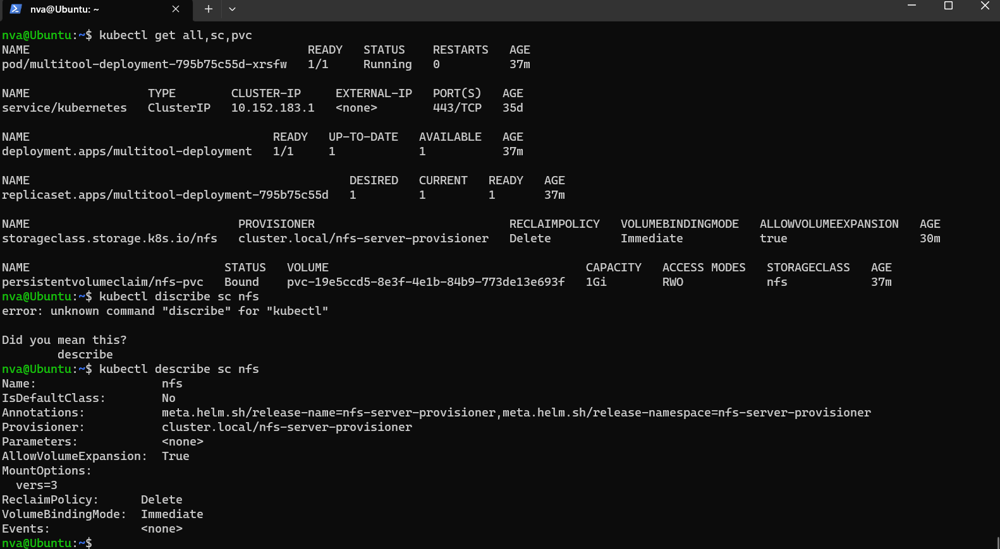
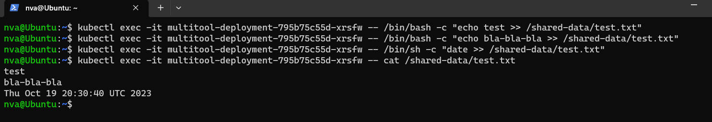

# Домашнее задание к занятию «Хранение в K8s. Часть 2» - Нечаев Владимир.

<details>
<summary>Цель задания, чеклист готовности к домашнему заданию, дополнительные материалы для выполнения задания</summary>

В тестовой среде Kubernetes нужно создать PV и продемострировать запись и хранение файлов.

------

### Чеклист готовности к домашнему заданию

1. Установленное K8s-решение (например, MicroK8S).
2. Установленный локальный kubectl.
3. Редактор YAML-файлов с подключенным GitHub-репозиторием.

------

### Дополнительные материалы для выполнения задания

1. [Инструкция по установке NFS в MicroK8S](https://microk8s.io/docs/nfs). 
2. [Описание Persistent Volumes](https://kubernetes.io/docs/concepts/storage/persistent-volumes/). 
3. [Описание динамического провижининга](https://kubernetes.io/docs/concepts/storage/dynamic-provisioning/). 
4. [Описание Multitool](https://github.com/wbitt/Network-MultiTool).

</details>

<details>
<summary>Задание 1</summary>

**Что нужно сделать**

Создать Deployment приложения, использующего локальный PV, созданный вручную.

1. Создать Deployment приложения, состоящего из контейнеров busybox и multitool.
2. Создать PV и PVC для подключения папки на локальной ноде, которая будет использована в поде.
3. Продемонстрировать, что multitool может читать файл, в который busybox пишет каждые пять секунд в общей директории. 
4. Удалить Deployment и PVC. Продемонстрировать, что после этого произошло с PV. Пояснить, почему.
5. Продемонстрировать, что файл сохранился на локальном диске ноды. Удалить PV.  Продемонстрировать что произошло с файлом после удаления PV. Пояснить, почему.
5. Предоставить манифесты, а также скриншоты или вывод необходимых команд.

</details>

<details>
<summary>Задание 2</summary>

### Задание 2

**Что нужно сделать**

Создать Deployment приложения, которое может хранить файлы на NFS с динамическим созданием PV.

1. Включить и настроить NFS-сервер на MicroK8S.
2. Создать Deployment приложения состоящего из multitool, и подключить к нему PV, созданный автоматически на сервере NFS.
3. Продемонстрировать возможность чтения и записи файла изнутри пода. 
4. Предоставить манифесты, а также скриншоты или вывод необходимых команд.

</details>


### Ответы: 

### Задание 1:

Манифест Deployment:

```yaml
apiVersion: apps/v1
kind: Deployment
metadata:
  name: deployment1
  labels:
    app: deployment1
spec:
  replicas: 1
  selector:
    matchLabels:
      app: deployment1
  template:
    metadata:
      labels:
        app: deployment1
    spec:
      containers:
        - name: busybox
          image: busybox
          command: ['sh', '-c', 'while true; do echo test task1 >> /output/output.txt; sleep 5; done']
          volumeMounts:
            - name: volume1
              mountPath: /output
        - name: multitool
          image: wbitt/network-multitool
          volumeMounts:
            - name: volume1
              mountPath: /input
      volumes:
        - name: volume1
          persistentVolumeClaim:
            claimName: pvc-vol
```

Манифест PV:

```yaml
apiVersion: v1
kind: PersistentVolume
metadata:
  name: pv1
spec:
  capacity:
    storage: 512Mi
  accessModes:
  - ReadWriteOnce
  storageClassName: host-path
  hostPath:
    path: /data/pv1
  persistentVolumeReclaimPolicy: Delete
```

Манифест PVC:

```yaml
apiVersion: v1
kind: PersistentVolumeClaim
metadata:
  name: pvc-vol
spec:
  volumeMode: Filesystem
  storageClassName: host-path
  accessModes:
  - ReadWriteOnce
  resources:
    requests:
      storage: 512Mi
```
Демонстрация, что multitool может читать файл, в который busybox пишет каждые пять секунд в общей директории:


Удалил Deployment и PVC:

После удаления Deployment и PVC статус тома PV поменялся с Bound на Failed. Я пологаю, что том PV отвязался от Pod'а.

Удалил PV:



После удаления PVС и PV. Файл остался на месте. В манифесте для PV политика `persistentVolumeReclaimPolicy`: `Delete`, но она срабатывает в облачных storage. У нас storage локальный. Поэтому файл не удаляется.


### Задание 2:

Для включения и настройки nfs-сервера использовал следующие команды:

```bash
microk8s enable nfs
```

```bash
microk8s enable community
```

```bash
sudo apt update && sudo apt install -y nfs-common
```

Создал деплоймент:

```yaml
apiVersion: v1
kind: PersistentVolumeClaim
metadata:
  name: nfs-pvc
spec:
  storageClassName: "nfs"
  accessModes:
    - ReadWriteOnce
  resources:
    requests:
      storage: 1Gi
---
apiVersion: apps/v1
kind: Deployment
metadata:
  name: multitool-deployment
spec:
  replicas: 1
  selector:
    matchLabels:
      app: multitool
  template:
    metadata:
      labels:
        app: multitool
    spec:
      containers:
      - name: multitool
        image: wbitt/network-multitool
        command: ["/bin/sleep", "infinity"]
        volumeMounts:
        - name: nfs-volume
          mountPath: /shared-data
      volumes:
      - name: nfs-volume
        persistentVolumeClaim:
          claimName: nfs-pvc
```
Скриншоты:




