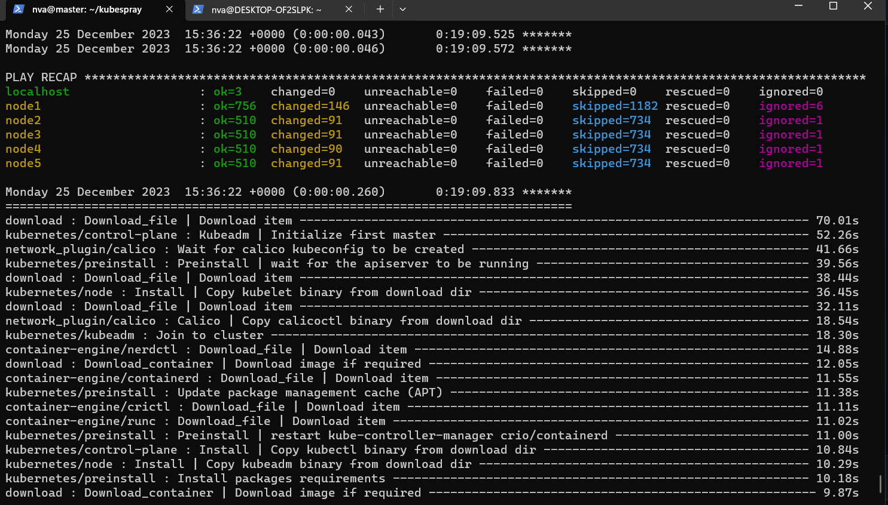
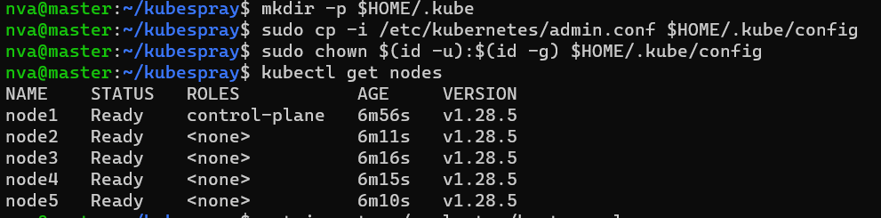

# Домашнее задание к занятию «Установка Kubernetes» Нечаев Владимир

<details>
<summary>Цель задания, чеклист готовности к домашнему заданию,дополнительные материалы</summary>

Установить кластер K8s.

### Чеклист готовности к домашнему заданию

1. Развёрнутые ВМ с ОС Ubuntu 20.04-lts.


### Инструменты и дополнительные материалы, которые пригодятся для выполнения задания

1. [Инструкция по установке kubeadm](https://kubernetes.io/docs/setup/production-environment/tools/kubeadm/create-cluster-kubeadm/).
2. [Документация kubespray](https://kubespray.io/).

</details>

<details>
<summary>Задание 1. Установить кластер k8s с 1 master node</summary>

1. Подготовка работы кластера из 5 нод: 1 мастер и 4 рабочие ноды.
2. В качестве CRI — containerd.
3. Запуск etcd производить на мастере.
4. Способ установки выбрать самостоятельно.

</details>

### Ответ:

1. Создал ВМ:
   
```bash
   nva@DESKTOP-OF2SLPK:~$ yc compute instance list
+----------------------+--------+---------------+---------+----------------+--------------+
|          ID          |  NAME  |    ZONE ID    | STATUS  |  EXTERNAL IP   | INTERNAL IP  |
+----------------------+--------+---------------+---------+----------------+--------------+
| epd2u4jp80d83son6gdu | w1     | ru-central1-b | RUNNING | 84.201.154.3   | 172.16.20.27 |
| epd5u4l0qq804ul8ihj7 | w3     | ru-central1-b | RUNNING | 158.160.19.130 | 172.16.20.24 |
| epdc7ck91hq15s52d5oo | w4     | ru-central1-b | RUNNING | 158.160.16.18  | 172.16.20.32 |
| epdnd2e80gd17v884f8k | w2     | ru-central1-b | RUNNING | 84.252.139.6   | 172.16.20.17 |
| epdq7j7qb57b3207q06d | master | ru-central1-b | RUNNING | 130.193.53.108 | 172.16.20.13 |
+----------------------+--------+---------------+---------+----------------+--------------+
```
2. Листинг использованных команд:
   - Скачал репозиторий:
   ```
   git clone https://github.com/kubernetes-sigs/kubespray
   ```
    - Установщик + зависимости:
    ```
    sudo apt install python3-pip
    ```
    ```
    sudo pip3 install -r requirements.txt
    ```
    - Скопировал директорию, объявил переменные:
   ```
   cp -rfp inventory/sample inventory/mycluster
   ```
   ```
   declare -a IPS=( 172.16.20.13 172.16.20.17 172.16.20.32 172.16.20.24 172.16.20.27)
   ```
   ```
   CONFIG_FILE=inventory/mycluster/hosts.yaml python3 contrib/inventory_builder/inventory.py ${IPS[@]}
   ```
    - Добавил `ansible_user: nva` и изменил `etcd`  `kube_control_plane`
   ```yaml
   nva@master:~/kubespray$ cat inventory/mycluster/hosts.yaml
   all:
    hosts:
     node1:
       ansible_host: 172.16.20.13
       ip: 172.16.20.13
       access_ip: 172.16.20.13
       ansible_user: nva
     node2:
       ansible_host: 172.16.20.17
       ip: 172.16.20.17
       access_ip: 172.16.20.17
       ansible_user: nva
     node3:
       ansible_host: 172.16.20.32
       ip: 172.16.20.32
       access_ip: 172.16.20.32
       ansible_user: nva
     node4:
       ansible_host: 172.16.20.24
       ip: 172.16.20.24
       access_ip: 172.16.20.24
       ansible_user: nva
     node5:
       ansible_host: 172.16.20.27
       ip: 172.16.20.27
       access_ip: 172.16.20.27
       ansible_user: nva
   children:
     kube_control_plane:
       hosts:
         node1:
     kube_node:
       hosts:
         node1:
         node2:
         node3:
         node4:
         node5:
     etcd:
       hosts:
         node1:
     k8s_cluster:
       children:
         kube_control_plane:
         kube_node:
     calico_rr:
       hosts: {}
   ```
    - Добавил ключ и дал доступ:
      ```
      chmod =600 ~/.ssh/id_rsa
      ```
    - Запустил плейбук:

      ```
      ansible-playbook -i inventory/mycluster/hosts.yaml cluster.yml -b -v
      ```
    - По оканчанию плейбука:
      

    - Проверка:
       
-----

### Правила приёма работы

1. Домашняя работа оформляется в своем Git-репозитории в файле README.md. Выполненное домашнее задание пришлите ссылкой на .md-файл в вашем репозитории.
2. Файл README.md должен содержать скриншоты вывода необходимых команд `kubectl get nodes`, а также скриншоты результатов.
3. Репозиторий должен содержать тексты манифестов или ссылки на них в файле README.md.
