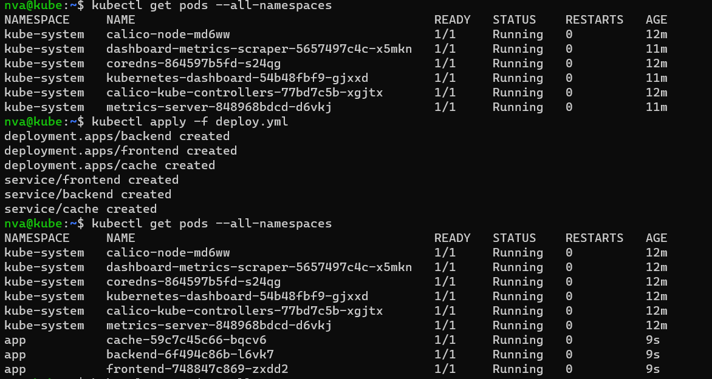
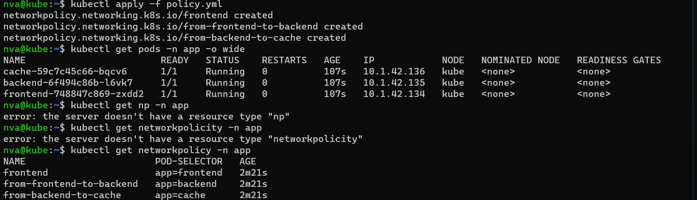

# Домашнее задание к занятию «Как работает сеть в K8s» - Нечаев Владимир

<details>
<summary>Цель задания. Чеклист готовности к домашнему заданию. Инструменты и дополнительные материалы, которые пригодятся для выполнения задания</summary>

Настроить сетевую политику доступа к подам.

### Чеклист готовности к домашнему заданию

1. Кластер K8s с установленным сетевым плагином Calico.

### Инструменты и дополнительные материалы, которые пригодятся для выполнения задания

1. [Документация Calico](https://www.tigera.io/project-calico/).
2. [Network Policy](https://kubernetes.io/docs/concepts/services-networking/network-policies/).
3. [About Network Policy](https://docs.projectcalico.org/about/about-network-policy).

</details>

<details>
<summary>Задание 1. Создать сетевую политику или несколько политик для обеспечения доступа</summary>

### Задание 1. Создать сетевую политику или несколько политик для обеспечения доступа

1. Создать deployment'ы приложений frontend, backend и cache и соответсвующие сервисы.
2. В качестве образа использовать network-multitool.
3. Разместить поды в namespace App.
4. Создать политики, чтобы обеспечить доступ frontend -> backend -> cache. Другие виды подключений должны быть запрещены.
5. Продемонстрировать, что трафик разрешён и запрещён.

</details>

<details>
<summary>Правила приёма работы</summary>

1. Домашняя работа оформляется в своём Git-репозитории в файле README.md. Выполненное домашнее задание пришлите ссылкой на .md-файл в вашем репозитории.
2. Файл README.md должен содержать скриншоты вывода необходимых команд, а также скриншоты результатов.
3. Репозиторий должен содержать тексты манифестов или ссылки на них в файле README.md.

</details>


## ОТВЕТ:

Манифест деплойментов:

```yml
---
apiVersion: apps/v1
kind: Deployment
metadata:
  name: backend
  namespace: app
  labels:
    app: backend
spec:
  replicas: 1
  selector:
    matchLabels:
      app: backend
  template:
    metadata:
      labels:
        app: backend
    spec:
      containers:
      - name: network-multitool-1
        image: wbitt/network-multitool
---
apiVersion: apps/v1
kind: Deployment
metadata:
  name: frontend
  namespace: app
  labels:
    app: frontend
spec:
  replicas: 1
  selector:
    matchLabels:
      app: frontend
  template:
    metadata:
      labels:
        app: frontend
    spec:
      containers:
      - name: network-multitool-2
        image: wbitt/network-multitool
---
apiVersion: apps/v1
kind: Deployment
metadata:
  name: cache
  namespace: app
  labels:
    app: cache
spec:
  replicas: 1
  selector:
    matchLabels:
      app: cache
  template:
    metadata:
      labels:
        app: cache
    spec:
      containers:
      - name: network-multitool-3
        image: wbitt/network-multitool
---
apiVersion: v1
kind: Service
metadata:
  namespace: app
  name: frontend
spec:
  selector:
    app: frontend
  ports:
  - port: 80
    name: frontend
---
apiVersion: v1
kind: Service
metadata:
  namespace: app
  name: backend
spec:
  selector:
    app: backend
  ports:
  - port: 80
    name: backend
---
apiVersion: v1
kind: Service
metadata:
  namespace: app
  name: cache
spec:
  selector:
    app: cache
  ports:
  - port: 80
    name: cache
```
Манифест политики:

```yaml
---
apiVersion: networking.k8s.io/v1
kind: NetworkPolicy
metadata:
  name: frontend
  namespace: app
spec:
  podSelector:
    matchLabels:
      app: frontend
  policyTypes:
    - Ingress
---
apiVersion: networking.k8s.io/v1
kind: NetworkPolicy
metadata:
  name: from-frontend-to-backend
  namespace: app
spec:
  podSelector:
    matchLabels:
      app: backend
  policyTypes:
    - Ingress
  ingress:
    - from:
        - podSelector:
            matchLabels:
              app: frontend
---
apiVersion: networking.k8s.io/v1
kind: NetworkPolicy
metadata:
  name: from-backend-to-cache
  namespace: app
spec:
  podSelector:
    matchLabels:
      app: cache
  policyTypes:
    - Ingress
  ingress:
    - from:
        - podSelector:
            matchLabels:
              app: backend
```

Запустил деплойменты:


Запустил политики:


Проыерка доступов:

