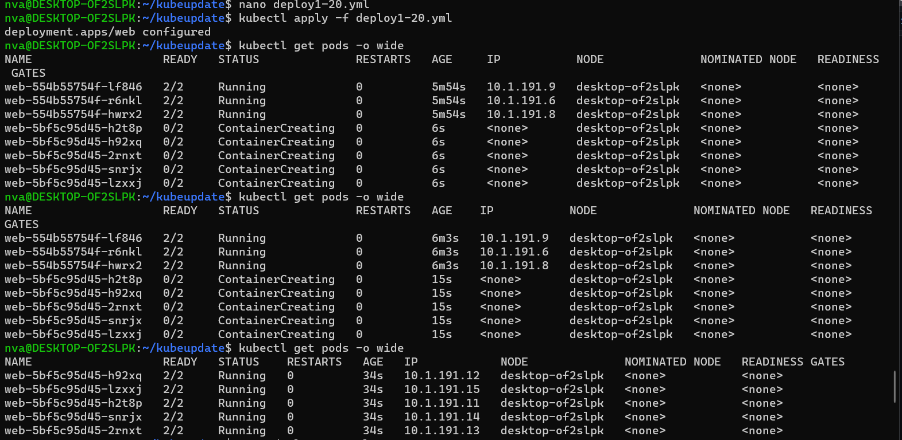

# Домашнее задание к занятию «Обновление приложений» - Нечаев Владимир

<details>
<summary>Цель задания, чеклист готовности к домашнему заданию, инструменты и дополнительные материалы</summary>

Выбрать и настроить стратегию обновления приложения.

### Чеклист готовности к домашнему заданию

1. Кластер K8s.

### Инструменты и дополнительные материалы, которые пригодятся для выполнения задания

1. [Документация Updating a Deployment](https://kubernetes.io/docs/concepts/workloads/controllers/deployment/#updating-a-deployment).
2. [Статья про стратегии обновлений](https://habr.com/ru/companies/flant/articles/471620/).

</details>

<details>
<summary>Задание 1. Выбрать стратегию обновления приложения и описать ваш выбор</summary>
  
### Задание 1. Выбрать стратегию обновления приложения и описать ваш выбор

1. Имеется приложение, состоящее из нескольких реплик, которое требуется обновить.
2. Ресурсы, выделенные для приложения, ограничены, и нет возможности их увеличить.
3. Запас по ресурсам в менее загруженный момент времени составляет 20%.
4. Обновление мажорное, новые версии приложения не умеют работать со старыми.
5. Вам нужно объяснить свой выбор стратегии обновления приложения.

</details>

<details>
<summary>Задание 2. Обновить приложение</summary>

### Задание 2. Обновить приложение

1. Создать deployment приложения с контейнерами nginx и multitool. Версию nginx взять 1.19. Количество реплик — 5.
2. Обновить версию nginx в приложении до версии 1.20, сократив время обновления до минимума. Приложение должно быть доступно.
3. Попытаться обновить nginx до версии 1.28, приложение должно оставаться доступным.
4. Откатиться после неудачного обновления.

</details>

Ответы:

### Задание 1.

```
Rolling update — постепенное обновление. Это стандартная стратегия развёртывания в Kubernetes. Она постепенно, один за другим заменяет поды со старой версией приложения
на поды с новой версией без простоя кластера.

Recreate — повторное создание. Стратегия, когда все старые поды одновременно удаляются и заменяются новыми.

Blue-green — создание копии и переброс трафика. Одновременное развёртывание старой и новой версий приложения.

Canary — частичное обновление и проверка. Используется, чтобы протестировать новую функциональность на отдельной группе пользователей.

A/B-тестирование - применяется, когда есть две версии приложения и мы не уверены на 100%, какая из них улучшит взаимодействие с пользователем.
```
Т.к. ресурсы ограничены то blue-green, canary, a/b тестирование не подходят (необходимо 2 версии приложения). Т.к. обновление мажорное, то остается только `Recreate`

### Задание 2.

Манифест:

```yaml
---
apiVersion : apps/v1
kind: Deployment
metadata:
  name: web 
  labels:
    app: web 
spec:
  replicas: 5
  strategy:
    type: RollingUpdate
    rollingUpdate:
      maxSurge: 50%
      maxUnavailable: 50%
  selector:
    matchLabels:
      app: web 
  template:
    metadata:
      labels:
        app: web 
    spec:
      containers:
        - name: multitool
          image: wbitt/network-multitool
          env:
            - name: HTTP_PORT
              value: "8080"
        - name: nginx
          image: nginx:1.19
```
Создал деплоймент:


Обновил nginx до 1.20:


Обновление до 1.28 упало в ошибку:


Откат обновления:


### Правила приёма работы

1. Домашняя работа оформляется в своем Git-репозитории в файле README.md. Выполненное домашнее задание пришлите ссылкой на .md-файл в вашем репозитории.
2. Файл README.md должен содержать скриншоты вывода необходимых команд, а также скриншоты результатов.
3. Репозиторий должен содержать тексты манифестов или ссылки на них в файле README.md.
