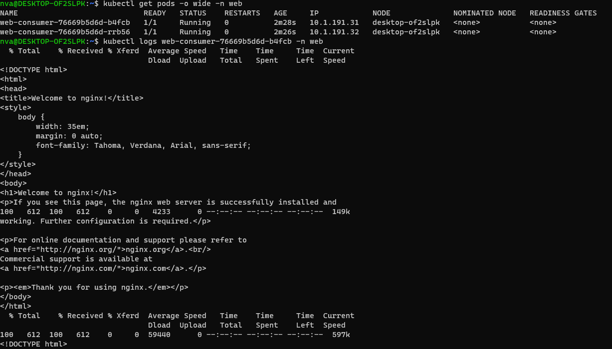

# Домашнее задание к занятию Troubleshooting - Нечаев Владиимир

<details>
<summary>Цель задания, чеклист готовности к домашнему заданию</summary>

### Цель задания

Устранить неисправности при деплое приложения.

### Чеклист готовности к домашнему заданию

1. Кластер K8s.

</details>
  
<details>
<summary>Задание. При деплое приложение web-consumer не может подключиться к auth-db. Необходимо это исправить</summary>
  
### Задание. При деплое приложение web-consumer не может подключиться к auth-db. Необходимо это исправить

1. Установить приложение по команде:
```shell
kubectl apply -f https://raw.githubusercontent.com/netology-code/kuber-homeworks/main/3.5/files/task.yaml
```
2. Выявить проблему и описать.
3. Исправить проблему, описать, что сделано.
4. Продемонстрировать, что проблема решена.

</details>

### Ответ:

При установке приложения выпола ошибка:

```bash
nva@DESKTOP-OF2SLPK:~$ kubectl apply -f https://raw.githubusercontent.com/netology-code/kuber-homeworks/main/3.5/files/task.yaml
Error from server (NotFound): error when creating "https://raw.githubusercontent.com/netology-code/kuber-homeworks/main/3.5/files/task.yaml": namespaces "web" not found
Error from server (NotFound): error when creating "https://raw.githubusercontent.com/netology-code/kuber-homeworks/main/3.5/files/task.yaml": namespaces "data" not found
Error from server (NotFound): error when creating "https://raw.githubusercontent.com/netology-code/kuber-homeworks/main/3.5/files/task.yaml": namespaces "data" not found
```

Создал неймспейсы:

```bash
nva@DESKTOP-OF2SLPK:~$ kubectl create namespace web
namespace/web created
nva@DESKTOP-OF2SLPK:~$ kubectl create namespace data
namespace/data created
nva@DESKTOP-OF2SLPK:~$ kubectl apply -f https://raw.githubusercontent.com/netology-code/kuber-homeworks/main/3.5/files/task.yaml
deployment.apps/web-consumer created
deployment.apps/auth-db created
service/auth-db created
nva@DESKTOP-OF2SLPK:~$  kubectl get pods -o wide -n web
NAME                            READY   STATUS    RESTARTS   AGE     IP            NODE              NOMINATED NODE   READINESS GATES
web-consumer-5f87765478-sw9lw   1/1     Running   0          9m30s   10.1.191.29   desktop-of2slpk   <none>           <none>
web-consumer-5f87765478-8jw7j   1/1     Running   0          9m30s   10.1.191.28   desktop-of2slpk   <none>           <none>
nva@DESKTOP-OF2SLPK:~$ kubectl get pods -o wide -n data
NAME                       READY   STATUS    RESTARTS   AGE     IP            NODE              NOMINATED NODE   READINESS GATES
auth-db-7b5cdbdc77-bzzrw   1/1     Running   0          9m51s   10.1.191.30   desktop-of2slpk   <none>           <none>
```

Вроде все хорошо, но при улубленном рассмотрении оказалось:


Командой `KUBE_EDITOR=nano kubectl edit deployment web-consumer -n web` отредактировал деплоймент:


Поды пересоздались автоматически, теперь вроде все хорошо:


### Правила приёма работы

1. Домашняя работа оформляется в своём Git-репозитории в файле README.md. Выполненное домашнее задание пришлите ссылкой на .md-файл в вашем репозитории.
2. Файл README.md должен содержать скриншоты вывода необходимых команд, а также скриншоты результатов.
3. Репозиторий должен содержать тексты манифестов или ссылки на них в файле README.md.
