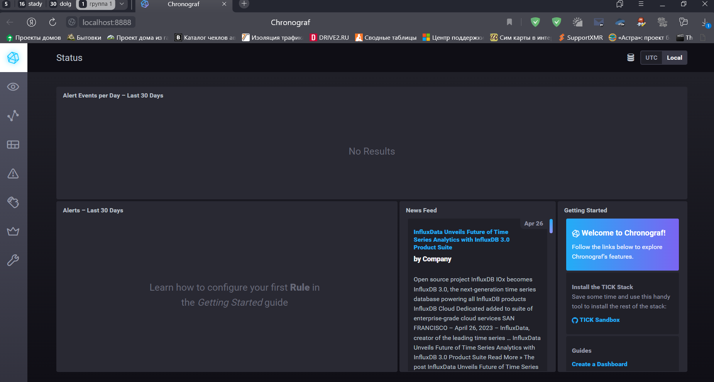
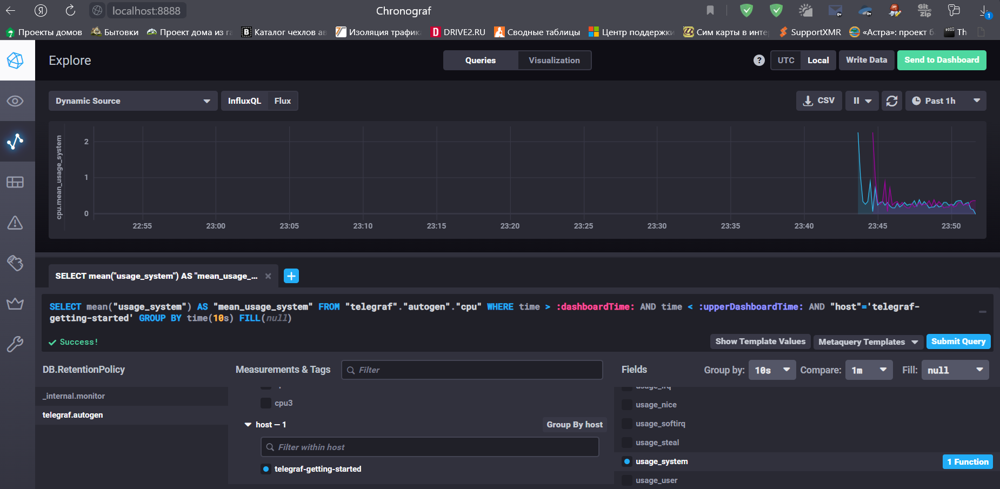
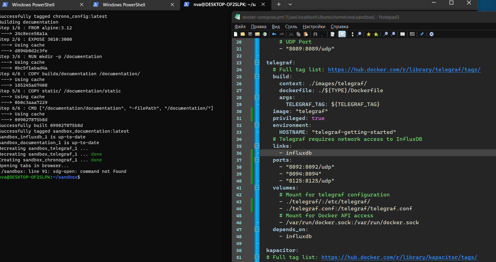
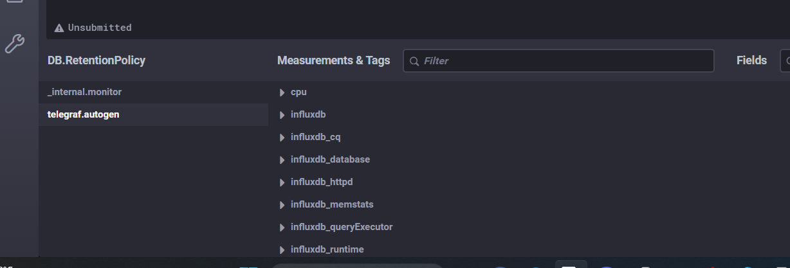
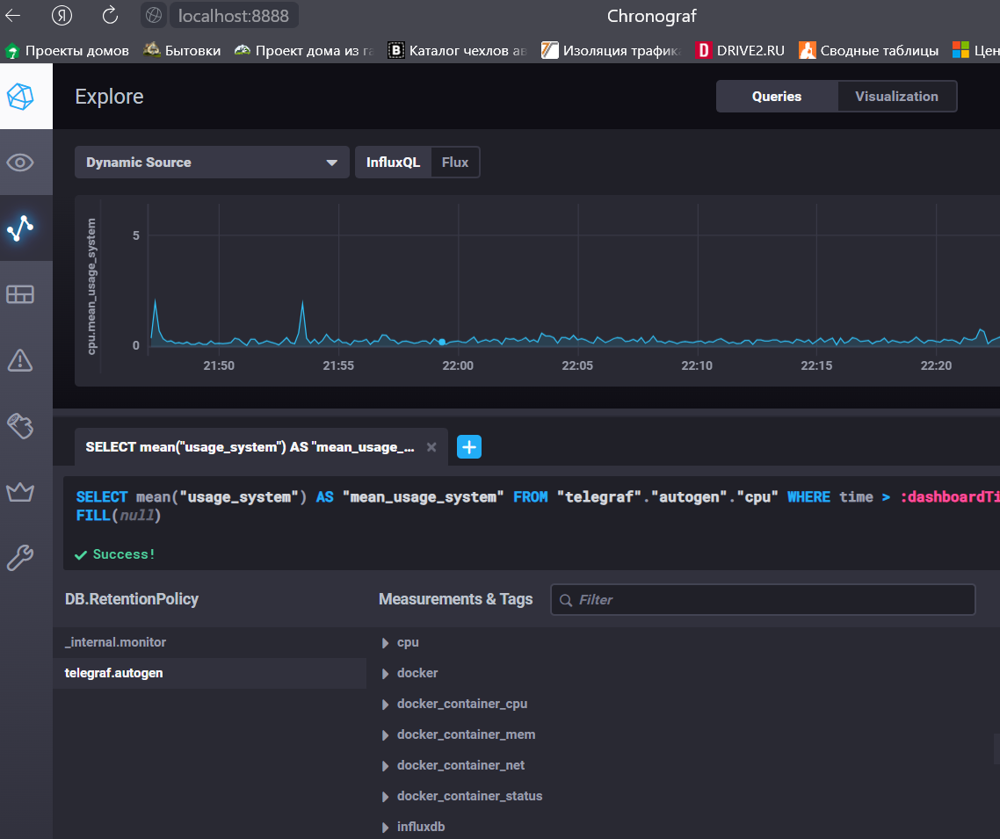

# Домашнее задание к занятию 13 «Введение в мониторинг» Нечаев Владимир

<details>
<summary>Обязательные задания</summary>

1. Вас пригласили настроить мониторинг на проект. На онбординге вам рассказали, что проект представляет из себя 
платформу для вычислений с выдачей текстовых отчетов, которые сохраняются на диск. Взаимодействие с платформой 
осуществляется по протоколу http. Также вам отметили, что вычисления загружают ЦПУ. Какой минимальный набор метрик вы
выведите в мониторинг и почему?
#
2. Менеджер продукта посмотрев на ваши метрики сказал, что ему непонятно что такое RAM/inodes/CPUla. Также он сказал, 
что хочет понимать, насколько мы выполняем свои обязанности перед клиентами и какое качество обслуживания. Что вы 
можете ему предложить?
#
3. Вашей DevOps команде в этом году не выделили финансирование на построение системы сбора логов. Разработчики в свою 
очередь хотят видеть все ошибки, которые выдают их приложения. Какое решение вы можете предпринять в этой ситуации, 
чтобы разработчики получали ошибки приложения?
#
4. Вы, как опытный SRE, сделали мониторинг, куда вывели отображения выполнения SLA=99% по http кодам ответов. 
Вычисляете этот параметр по следующей формуле: summ_2xx_requests/summ_all_requests. Данный параметр не поднимается выше 
70%, но при этом в вашей системе нет кодов ответа 5xx и 4xx. Где у вас ошибка?
#
5. Опишите основные плюсы и минусы pull и push систем мониторинга.
#
6. Какие из ниже перечисленных систем относятся к push модели, а какие к pull? А может есть гибридные?

    - Prometheus 
    - TICK
    - Zabbix
    - VictoriaMetrics
    - Nagios
#
7. Склонируйте себе [репозиторий](https://github.com/influxdata/sandbox/tree/master) и запустите TICK-стэк, 
используя технологии docker и docker-compose.

В виде решения на это упражнение приведите скриншот веб-интерфейса ПО chronograf (`http://localhost:8888`). 

P.S.: если при запуске некоторые контейнеры будут падать с ошибкой - проставьте им режим `Z`, например
`./data:/var/lib:Z`
#
8. Перейдите в веб-интерфейс Chronograf (http://localhost:8888) и откройте вкладку Data explorer.
        
    - Нажмите на кнопку Add a query
    - Изучите вывод интерфейса и выберите БД telegraf.autogen
    - В `measurments` выберите cpu->host->telegraf-getting-started, а в `fields` выберите usage_system. Внизу появится график утилизации cpu.
    - Вверху вы можете увидеть запрос, аналогичный SQL-синтаксису. Поэкспериментируйте с запросом, попробуйте изменить группировку и интервал наблюдений.

Для выполнения задания приведите скриншот с отображением метрик утилизации cpu из веб-интерфейса.
#
9. Изучите список [telegraf inputs](https://github.com/influxdata/telegraf/tree/master/plugins/inputs). 
Добавьте в конфигурацию telegraf следующий плагин - [docker](https://github.com/influxdata/telegraf/tree/master/plugins/inputs/docker):
```
[[inputs.docker]]
  endpoint = "unix:///var/run/docker.sock"
```

Дополнительно вам может потребоваться донастройка контейнера telegraf в `docker-compose.yml` дополнительного volume и 
режима privileged:
```
  telegraf:
    image: telegraf:1.4.0
    privileged: true
    volumes:
      - ./etc/telegraf.conf:/etc/telegraf/telegraf.conf:Z
      - /var/run/docker.sock:/var/run/docker.sock:Z
    links:
      - influxdb
    ports:
      - "8092:8092/udp"
      - "8094:8094"
      - "8125:8125/udp"
```

После настройке перезапустите telegraf, обновите веб интерфейс и приведите скриншотом список `measurments` в 
веб-интерфейсе базы telegraf.autogen . Там должны появиться метрики, связанные с docker.

Факультативно можете изучить какие метрики собирает telegraf после выполнения данного задания.

</details>

<details>
<summary>Дополнительное задание* (со звёздочкой)</summary>

Дополнительно вам может потребоваться донастройка контейнера telegraf в `docker-compose.yml` дополнительного volume и 
режима privileged:
```
  telegraf:
    image: telegraf:1.4.0
    privileged: true
    volumes:
      - ./etc/telegraf.conf:/etc/telegraf/telegraf.conf:Z
      - /var/run/docker.sock:/var/run/docker.sock:Z
    links:
      - influxdb
    ports:
      - "8092:8092/udp"
      - "8094:8094"
      - "8125:8125/udp"
```

После настройке перезапустите telegraf, обновите веб интерфейс и приведите скриншотом список `measurments` в 
веб-интерфейсе базы telegraf.autogen . Там должны появиться метрики, связанные с docker.

Факультативно можете изучить какие метрики собирает telegraf после выполнения данного задания.

## Дополнительное задание (со звездочкой*) - необязательно к выполнению

1. Вы устроились на работу в стартап. На данный момент у вас нет возможности развернуть полноценную систему 
мониторинга, и вы решили самостоятельно написать простой python3-скрипт для сбора основных метрик сервера. Вы, как 
опытный системный-администратор, знаете, что системная информация сервера лежит в директории `/proc`. 
Также, вы знаете, что в системе Linux есть  планировщик задач cron, который может запускать задачи по расписанию.

Суммировав все, вы спроектировали приложение, которое:
- является python3 скриптом
- собирает метрики из папки `/proc`
- складывает метрики в файл 'YY-MM-DD-awesome-monitoring.log' в директорию /var/log 
(YY - год, MM - месяц, DD - день)
- каждый сбор метрик складывается в виде json-строки, в виде:
  + timestamp (временная метка, int, unixtimestamp)
  + metric_1 (метрика 1)
  + metric_2 (метрика 2)
  
     ...
     
  + metric_N (метрика N)
  
- сбор метрик происходит каждую 1 минуту по cron-расписанию

Для успешного выполнения задания нужно привести:

а) работающий код python3-скрипта,

б) конфигурацию cron-расписания,

в) пример верно сформированного 'YY-MM-DD-awesome-monitoring.log', имеющий не менее 5 записей,

P.S.: количество собираемых метрик должно быть не менее 4-х.
P.P.S.: по желанию можно себя не ограничивать только сбором метрик из `/proc`.

2. В веб-интерфейсе откройте вкладку `Dashboards`. Попробуйте создать свой dashboard с отображением:

    - утилизации ЦПУ
    - количества использованного RAM
    - утилизации пространства на дисках
    - количество поднятых контейнеров
    - аптайм
    - ...
    - фантазируйте)

</details>

### Ответ на обязательные задания:

1. Мой минимальный набор метрик:
   - загрузка CPU- что бы следить как сервис нагружает процессор
   - inodes - переполнение индексных дискрипторов
   - иные метрики HDD, (такие как объем свободного пространства, скорость read/write) - помогут выявить проблемы с жесткими дисками системы
   - http/https - проверка доступности нашего сервиса по http/https на уровне кодов ответа

2. Могу предложить:
   Заключить SLA (соглашение об уровне доступности сервиса), качество которого будет описано в SLO (целевой уровень качества обслуживания). В качестве мониторинга предложу SLI (индикатор качества обслуживания).

3. Могу предложить решения на выбор:
   на Sentry, или на Graylog, можно еще Elasticsearch, Logstash и Kibana (ELK), ну или самописные скрипты (bash/python)

4. Ошибка:
   нужна формула (summ_1xx_requests + summ_2xx_requests + summ_3xx_requests)/summ_all_requests
   либо
   (summ_all_requests - summ_4xx_requests - summ_5xx_requests)/summ_all_requests

5. Плюсы:
   
   push-модели:

упрощение репликации данных в разные системы мониторинга или их резервные копии
более гибкая настройка отправки пакетов данных с метриками
UDP — это менее затратный способ передачи данных, из-за чего может возрасти производительность сбора метрик

  pull-модели:

легче контролировать подлинность данных
можно настроить единый proxy server до всех агентов с TLS
упрощённая отладка получения данных с агентов

  минусы Pull-модели:

привязанность к инструментам, оперирующим pull'ами
  
  минусы Push-модели:

UDP не гаранирует доставку

6.
  
Prometheus - Pull
TICK - Push
Zabbix - Push/Pull
VictoriaMetrics - Push/Pull
Nagios - Pull

7. Скрин localhost:
   

8. Скрин CPU:
   

Скрин la:
   


9. Изменил docker-compose:
 

но метрики не появились....

 

 после выдачи прав на docker.socket всем, метрики появились...

  
